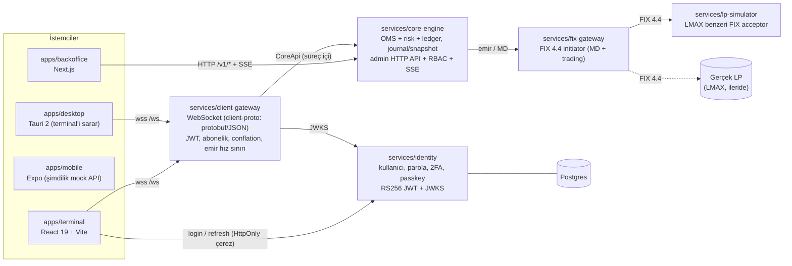

# fxvps.ai

Modern, çok kiracılı (multi-tenant) trading platformu: likidite sağlayıcılarına (ör. LMAX) FIX API ile bağlanır, son kullanıcılara alt hesaplar ve MetaTrader 5 / cTrader sınıfında süper modern bir trading terminali (web, masaüstü, mobil), broker'a da bir back office sunar.

## Mimari (main'de bugün olan)



Notlar:
- `client-gateway --demo` lp-simulator + fix-gateway + core-engine'i **tek süreçte** başlatır (`core_engine::stack::CoreStack`). Süreçlerin NATS ile ayrılması sonraki iştir.
- `core-engine` ayrı ikili olarak da çalışır (back office'in konuştuğu admin API).
- `crates/`: `domain` (fixed-point tipler), `money`, `fix-codec`, `fix-session`, `oms`, `risk`, `ledger`, `client-proto` (istemci tel protokolü, `PROTOCOL.md`). `packages/trading-core`: TS ortak para/doğrulama mantığı.
- `tools/loadgen`: client-gateway için WebSocket yük üreteci (bkz. [docs/05](docs/05-performans.md)).
- Dağıtım: `infra/docker/*` (distroless, root olmayan imajlar), `deploy/compose` (yerel altyapı), `deploy/helm/fxvps`.

## Hızlı başlangıç

Gereksinim: Rust stable (≥ 1.87, `rust-toolchain.toml`), Node 22 + pnpm (uygulamalar için).

```bash
# Kalite kapıları
cargo fmt --all --check
cargo clippy --all-targets -- -D warnings
cargo test

# 1) Canlı demo gateway (simülatör + FIX gateway + core-engine süreç içi)
cargo run -p client-gateway -- --demo --listen 127.0.0.1:8080
#   çıktı: FXVPS_WS_URL=ws://127.0.0.1:8080/ws ve FXVPS_DEMO_TOKEN=<jwt> (yalnız DEV anahtarı)

# 2) Terminal (ayrı terminalde)
cd apps/terminal && pnpm install && pnpm dev
#   mock:  http://localhost:5173
#   canlı: http://localhost:5173/?api=ws&url=ws://127.0.0.1:8080/ws&token=<FXVPS_DEMO_TOKEN>

# 3) Back office canlı (core-engine admin API + dev jetonu)
CORE_ADMIN_ADDR=127.0.0.1:8091 CORE_DATA_DIR=./data CORE_DEV_AUTH=1 CORE_SEED=1 \
  CORE_CORS_ORIGINS=http://localhost:3000 cargo run -p core-engine
cd apps/backoffice && NEXT_PUBLIC_API_URL=http://127.0.0.1:8091 pnpm dev   # http://localhost:3000

# 4) Identity (bellek içi depo, geçici anahtar, log'a yazan posta — yalnız geliştirme)
cargo run -p identity                                   # FXVPS_IDENTITY_URL=http://127.0.0.1:8090
FXVPS_JWT_JWKS_URL=http://127.0.0.1:8090/.well-known/jwks.json \
  FXVPS_JWT_ISSUER=http://127.0.0.1:8090 FXVPS_JWT_AUDIENCE=fxvps \
  cargo run -p client-gateway -- --demo                 # gateway identity jetonlarını kabul eder

# 5) Yük testi
cargo run --release -p loadgen -- --spawn-demo --clients 50 --duration 30
```

(core-engine ve identity varsayılan olarak ikisi de `127.0.0.1:8090` dinler; birlikte çalıştırırken birini taşıyın.)

> **Uyarı:** `--demo`, `CORE_DEV_AUTH=1`, varsayılan JWT anahtarları ve identity'nin log posta sağlayıcısı yalnız yerel geliştirme içindir. Üretim önkoşulları için [docs/06](docs/06-guvenlik-incelemesi.md) (G1, G2, G4).

FIX tarafı: gerçek LP parolaları depoya girmez (`FIX_GATEWAY_MD_PASSWORD` / `FIX_GATEWAY_TRADE_PASSWORD`). LMAX'e özgü ayrıntılar **varsayımdır**; docs/02'deki `[DOĞRULA]` maddeleri LMAX spesifikasyonu ile kapatılmalıdır.

## Durum (kilometre taşları, docs/03)

| Taş | Kapsam | Durum |
|---|---|---|
| M0 | Araştırma, mimari, yol haritası | Tamam (docs 01–03; LMAX doğrulamaları açık) |
| M1 | FIX codec/session, MD + trading gateway, LP simülatörü | Simülatöre karşı tamam; LMAX UAT conformance yapılmadı |
| M2 | OMS, risk, ledger, journal/snapshot | Çekirdek main'de (core-engine); aggregator, mutabakat ve NATS ile süreç ayrımı yok |
| M3 | Web terminal + client-api (client-gateway) + identity | Terminal canlı gateway'e bağlanıyor; identity (parola, 2FA, passkey, JWKS) main'de |
| M4 | Back office | Admin API + RBAC + dört göz + canlı akış; KYC/ödeme/raporlar kısmi |
| M5 | Masaüstü, mobil | Tauri kabuğu CI'da derleniyor; Expo uygulaması mock API ile |
| Sertleştirme | Yük testi, güvenlik incelemesi | `tools/loadgen`, docs/05, docs/06 (bulgular açık, düzeltilmedi) |

## Belgeler

[docs/README.md](docs/README.md) dizini: rakip analizi, FIX/likidite, teknoloji mimarisi, operasyon, performans, güvenlik incelemesi. Servis/uygulama ayrıntıları kendi README'lerinde (`services/*/README.md`, `apps/*/README.md`, `crates/client-proto/PROTOCOL.md`).

Geliştirme yalnız PR üzerinden yürür; `main` doğrudan push almaz.
