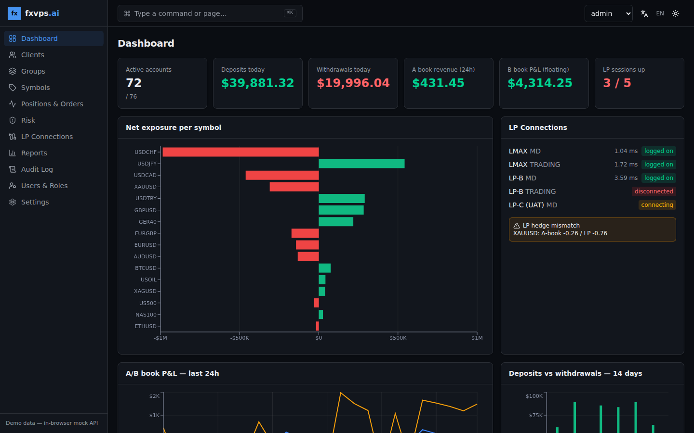

# fxvps.ai — Back office (M4)

Next.js 16 (App Router, static export) + React 19 + TypeScript strict,
Tailwind v4, local shadcn-style components, TanStack Table/Query, Zod,
Recharts. Runs entirely in the browser against a seeded mock `AdminApi`
(see [API.md](./API.md)).



## Screens
Dashboard · Clients & sub-accounts (detail drawer, KYC, deposit/withdraw/credit
with confirmation + audit + 4-eyes) · Groups · Symbols (specs, swaps,
sessions) · Positions & Orders (live, filters, force close) · Risk (top
exposures, margin calls, stop-out queue, ESMA presets) · LP connections (FIX
status, seq numbers, latency, reconnect) · Reports (trades, statements, CSV) ·
Audit log · Users & roles (RBAC matrix) · Settings.

Dark/light theme, ⌘K / Ctrl+K command palette, English + Turkish, responsive.
The role switcher in the header is a demo stand-in for OIDC login.

## Commands
```bash
pnpm install --frozen-lockfile
pnpm dev            # http://localhost:3000
pnpm typecheck && pnpm lint && pnpm test
pnpm build          # static export to out/
NEXT_PUBLIC_BASE_PATH=/fxvps.ai pnpm build   # GitHub Pages sub-path
PLAYWRIGHT_BROWSERS_PATH=/opt/pw-browsers pnpm e2e   # needs a prior build
```

`NEXT_PUBLIC_API_URL` switches from the mock to the HTTP adapter.

## Money
All balances/P&L are integers in minor units (`src/lib/money.ts`); formatting
uses string math so no float rounding can occur.
