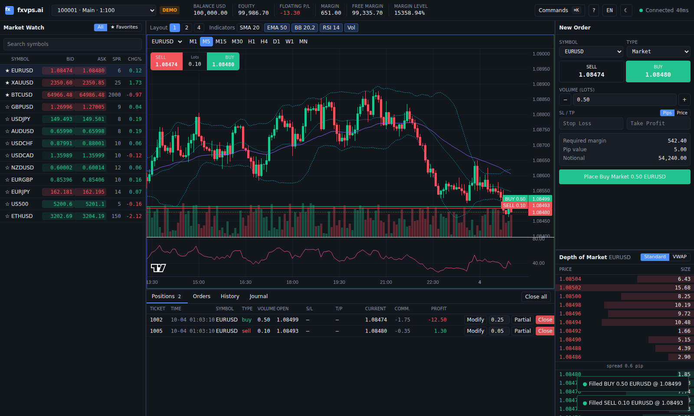

# fxvps.ai Web Terminal (M3 MVP)

React 19 + TypeScript (strict) + Vite web trading terminal — an MT5/cTrader
hybrid. Runs fully standalone in the browser against an in-browser mock
backend, or live against `services/client-gateway` over the binary protobuf
protocol (see [PROTOCOL.md](./PROTOCOL.md)).



## Run

```bash
cd apps/terminal
pnpm install
pnpm dev            # http://localhost:5173  (mock backend)

# live gateway (from the repo root): prints FXVPS_WS_URL=... and FXVPS_DEMO_TOKEN=...
cargo run -p client-gateway -- --demo --listen 127.0.0.1:8080
# then open http://localhost:5173/?api=ws&url=ws://127.0.0.1:8080/ws&token=<FXVPS_DEMO_TOKEN>
# or use the "Gateway" button in the top bar (stored per tab in sessionStorage)
```

| Script | What |
|---|---|
| `pnpm typecheck` | `tsc -b` (strict, `noUncheckedIndexedAccess`) |
| `pnpm lint` | ESLint flat config (typescript-eslint, react-hooks) |
| `pnpm test` | Vitest + Testing Library (money/P&L/margin math, validation, mock engine, store, ticket) |
| `pnpm build` | Production build to `dist/` |
| `pnpm e2e` | Playwright smoke test (Chromium; set `PLAYWRIGHT_BROWSERS_PATH` if browsers are pre-installed) |
| `pnpm e2e:live` | Playwright against a real `client-gateway --demo` (needs cargo; builds/starts it) |
| `pnpm proto:gen` | Regenerates `src/api/gen` from `crates/client-proto/proto` (buf + protoc-gen-es) |
| `pnpm screenshot` | Regenerates `docs/screenshot.png` (needs `pnpm preview` running) |

## Features

- **Top bar** — account / sub-account selector, balance, equity, floating P/L,
  margin, free margin, margin level, connection state + latency, EN/TR, dark/light,
  ⌘K command palette (cmdk).
- **Market Watch** — bid/ask/spread/daily change, flashing ticks, search,
  favourites (★, persisted), click → chart, double-click → order ticket. Virtualized.
- **Charts** — TradingView Lightweight Charts candlesticks, M1…MN, 1/2/4 chart
  grid (resizable), crosshair, volume, SMA 20 / EMA 50 / Bollinger 20,2 / RSI 14
  (computed client-side, RSI in its own pane), one-click Sell/Buy overlay with
  lot input, position / SL / TP / pending order price lines.
- **Order ticket** — market / limit / stop / stop-limit, lots with step buttons,
  SL/TP in price or pips, expiry (GTC by default), live required margin, pip
  value, notional, risk-at-SL / reward-at-TP, validation messages.
- **Depth of Market** — standard ladder with size bars, VWAP fill preview
  (average/worst price, slippage, partial-fill warning) for any size.
- **Toolbox** — Positions (live P/L, close, partial close, modify SL/TP, close
  all), Pending orders (cancel), History (deals + total), Journal. Virtualized.
- **Layout** — resizable panels (react-resizable-panels); UI preferences persisted in `localStorage`.

## Keyboard shortcuts

| Keys | Action |
|---|---|
| `F9` | New order ticket |
| `Ctrl/⌘ + K` | Command palette |
| `F7` / `F8` | Previous / next chart |
| `Alt + 1` / `2` / `4` | Chart layout |
| `[` / `]` | Previous / next timeframe on active chart |
| `Shift + B` / `Shift + S` | One-click buy / sell on active chart (one-click lot size) |
| `Alt + T` | Toggle theme |
| `/` | Focus Market Watch search |
| `?` | Shortcut help |
| `Esc` | Close dialog |

Defined once in `src/shortcuts.ts` (also shown in-app with `?`).

## Architecture

```
src/
  api/types.ts      TradingApi interface + domain types (the schema)
  api/mock.ts       MockTradingApi: random walk, matching, SL/TP, stop-out, sub-accounts
  api/ws.ts         WsTradingApi: client-gateway adapter (protobuf, gen/)
  lib/money.ts      decimal-safe math (big.js): P/L, margin, pip value, conversion
  lib/validation.ts order ticket validation
  lib/indicators.ts SMA / EMA / Bollinger / RSI
  lib/depth.ts      VWAP fill walk
  lib/rafBatcher.ts tick conflation → one store update per animation frame
  store/            Zustand store + bootstrap wiring API → store
  i18n/             en + tr dictionaries (typed keys; tr must cover every key)
  components/       UI
```

**Money:** balances, P/L, margin and commission are integer minor units
(cents); volume is integer centi-lots; all arithmetic on prices goes through
big.js and is rounded once at the end (margin rounds up). No float math on money.

**Performance:** ticks are conflated per symbol and applied once per
`requestAnimationFrame`; Market Watch rows and toolbox rows subscribe to their
own slice and are virtualized (@tanstack/react-virtual); charts use
`series.update()` for the live bar.

## Known gaps (MVP)

- No auth/OIDC; the WS adapter is untested against a real server.
- Netting accounts, trailing stops, Price DoM (click-to-trade ladder), drawing
  tools, chart-line drag-to-modify and workspace cloud sync are not implemented.
- Pending order modify exists in the API but has no UI (cancel + re-place).
- Non-USD account currencies work in the math but the mock only offers USD.

## Licenses

Charts by [TradingView Lightweight Charts](https://www.tradingview.com/lightweight-charts/)
(Apache-2.0) — see [NOTICE](./NOTICE). The TradingView attribution logo is kept on every chart.
