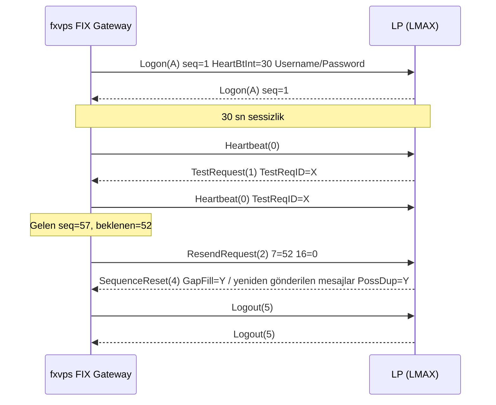
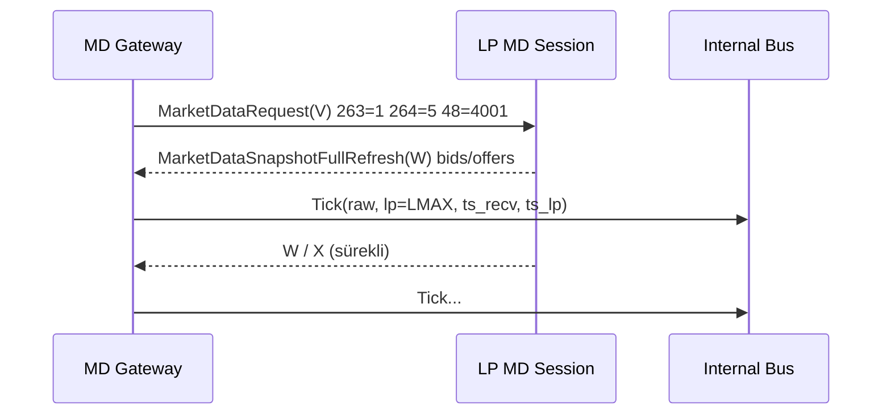
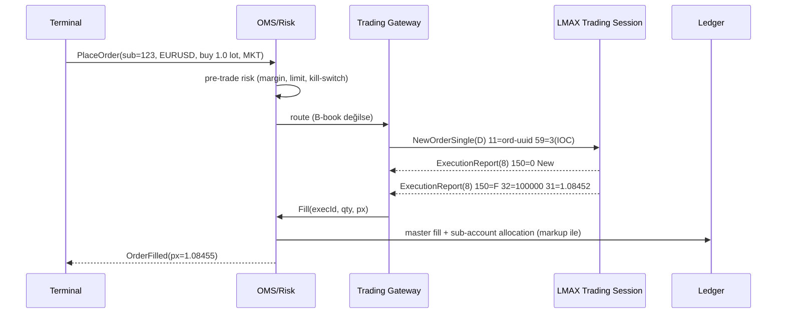
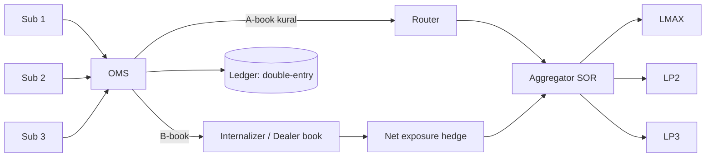

# 02 — FIX Likidite Entegrasyonu (fxvps.ai)

> Durum: taslak (M0). Belirsiz/doğrulanmamış bilgiler **[DOĞRULA]** ile işaretlidir. LMAX'in güncel FIX spesifikasyonları kamuya tam açık değildir; onboarding sırasında LMAX'ten alınan PDF/dictionary esas alınmalıdır.

## 1. FIX 4.4 temelleri

### 1.1 Katmanlar
- **Session layer**: TCP üzerinde TLS (LMAX prod'da TLS/stunnel ya da cross-connect — [DOĞRULA]), `BeginString=FIX.4.4`, `SenderCompID(49)`/`TargetCompID(56)`, `MsgSeqNum(34)`, `SendingTime(52)`, `CheckSum(10)`, `BodyLength(9)`.
- **Application layer**: market data ve trading mesajları.

### 1.2 Oturum yaşam döngüsü
| Mesaj | MsgType | Not |
|---|---|---|
| Logon | A | `HeartBtInt(108)`, `Username(553)`/`Password(554)`, `ResetSeqNumFlag(141)` |
| Heartbeat | 0 | HeartBtInt sessizlikte gönderilir; TestRequest cevabında `TestReqID(112)` döner |
| TestRequest | 1 | Karşı taraf canlı mı? Cevap gelmezse bağlantı düşürülür |
| ResendRequest | 2 | `BeginSeqNo(7)`/`EndSeqNo(16)` (0 = sonsuz) |
| Reject | 3 | Session seviyesinde ret |
| SequenceReset | 4 | `GapFillFlag(123)=Y` ile admin mesajlarını atlama; `PossDupFlag(43)=Y` |
| Logout | 5 | Düzgün kapanış |

**Sequence number kuralları**: Gelen seq beklenenden büyükse → gap → ResendRequest. Küçükse ve PossDup değilse → kritik hata, logout. Seq store kalıcı olmalı (dosya/DB); günlük reset saati LP ile anlaşılır (LMAX'te haftalık/günlük reset politikası [DOĞRULA]).

**Resend politikası (bizim taraf)**: Emirler için *resend etme, gap-fill gönder* (bayat emir piyasaya gitmesin) — bunun yerine reconnect sonrası `OrderStatusRequest(H)` / `OrderMassStatusRequest(AF)` (destekleniyorsa) ve drop copy ile mutabakat.

### 1.3 Market data
- `MarketDataRequest(V)`: `MDReqID(262)`, `SubscriptionRequestType(263)` (1=subscribe, 2=unsubscribe), `MarketDepth(264)`, `MDUpdateType(265)`, `NoMDEntryTypes(267)` → `MDEntryType(269)` 0=Bid 1=Offer, `NoRelatedSym(146)` → `SecurityID(48)` + `SecurityIDSource(22)` (LMAX instrument ID'leri sayısal — EUR/USD = 4001, LMAX Global Python SDK örnek verisinde teyitli; `SecurityIDSource=8` değeri hâlâ [DOĞRULA]).
- `MarketDataSnapshotFullRefresh(W)`: tüm defter. FIX kuralına göre W ile abone olunduğunda her güncelleme, istenen derinlikteki iki tarafın tamamını yeniden taşır (B2BITS FIXopaedia). LMAX'in yalnız W mi yoksa X de mi gönderdiği kamuya açık kaynakta bulunamadı — [DOĞRULA]. Gateway her iki modu da desteklemeli.
- `MarketDataIncrementalRefresh(X)`: `MDUpdateAction(279)` 0/1/2 (new/change/delete). Diğer LP'lerde (Integral, PrimeXM) yaygın.
- `MarketDataRequestReject(Y)`.

### 1.4 Trading
- `NewOrderSingle(D)`: `ClOrdID(11)` (benzersiz, idempotent anahtar), `SecurityID(48)`, `Side(54)`, `OrderQty(38)`, `OrdType(40)` (1=Market, 2=Limit, 3=Stop…), `Price(44)`, `TimeInForce(59)` — ikincil kaynağa göre (LMAX'in resmi dokümanı değil) spot FX'te emir tipleri Market/Limit/Iceberg/Dark Limit, TIF ise IOC/FOK/DAY; GTC emirler bağlantı kopunca iptal ediliyor; taker'lar için yalnız IOC/FOK. Resmi spec ile [DOĞRULA], `TransactTime(60)`.
- `ExecutionReport(8)`: `ExecType(150)` (0 New, 4 Canceled, 8 Rejected, F Trade, I OrderStatus), `OrdStatus(39)`, `LastQty(32)`, `LastPx(31)`, `CumQty(14)`, `LeavesQty(151)`, `AvgPx(6)`, `ExecID(17)` (fill dedup anahtarı).
- `OrderCancelRequest(F)`, `OrderCancelReplaceRequest(G)`, `OrderCancelReject(9)`.
- Pozisyon: `RequestForPositions(AN)` / `PositionReport(AP)` — LMAX FIX'te pozisyon sorgusunun desteklenip desteklenmediği [DOĞRULA]; desteklenmiyorsa pozisyon = kendi fill defterimizden türetilir + günlük LP statement (CSV/SFTP) ile mutabakat.

## 2. LMAX özellikleri

| Konu | Bilinen | Durum |
|---|---|---|
| Ayrı oturumlar | Market data ve trading için ayrı FIX session/CompID (genellikle farklı host/port) | Sektörde yaygın; LMAX için [DOĞRULA] |
| Enstrüman kimliği | Sayısal `SecurityID`; EUR/USD = 4001 | 4001 teyitli (lmax-python-sdk örneği); IDSource değeri [DOĞRULA] |
| Book | Snapshot (W) ile derinlik; MarketDepth seçimi | [DOĞRULA] |
| Ortamlar | Demo/UAT (London demo) → conformance testi → prod | Onboarding sırasında |
| Bağlantı / veri merkezleri | Birincil site Equinix LD4/5 (Slough); NY4 ve TY3'te de matching engine/erişim; LD4 civarında ~200 katılımcı cross-connect ile bağlanabiliyor | Equinix basın bülteni ve basın haberleriyle teyitli |
| Likidite modeli | Firm liquidity, **no last look**, FCA düzenlemeli MTF; ortalama eşleştirme < 4 ms (LMAX beyanı, basın) | Teyitli (ikincil) |
| FIX sürümü | FIX 4.2/4.4; drop copy FIX ile ya da web üzerinden | İkincil kaynak; [DOĞRULA] |
| Rate limit | İkincil kaynakta "1.000 emir/sn'ye kadar" geçiyor; hesap ve sözleşme bazında değişebilir | [DOĞRULA] |
| Min lot / tick | Enstrüman başına (FX genelde 0.1 contract = 10k) | [DOĞRULA] |
| Ayrıca | LMAX Java/.NET "Trader API" (FIX dışı, eski) mevcut | Scribd'deki eski spec |
| Test aracı | LMAX'in açık kaynak `nanofix` (Java, Apache-2.0) FIX test istemcisi; conformance/simülatör testlerinde kullanılabilir | GitHub'da teyitli |

Onboarding listesi: hesap + kredi limiti → UAT CompID'leri → IP whitelist → conformance senaryoları (logon/seq reset/gap fill, MKT/LMT/IOC/FOK, cancel/replace, reject) → prod CompID → drop copy session (varsa).

## 3. Diğer LP / aggregator'lar
| Sağlayıcı | Rol | Not |
|---|---|---|
| LMAX Exchange/Global | MTF/ECN, firm likidite, no last look | ilk hedef |
| Integral | Aggregation + banka likiditesi, FIX | |
| oneZero (Hub) | Bridge/aggregator, MT4/5 entegrasyon | Kendi bridge yerine alternatif |
| PrimeXM (XCore) | Bridge/aggregator, FIX | |
| Centroid (Bridge) | Bridge + risk | |
| Gold-i (Matrix) | Bridge/aggregator | |
| Finalto, IS Prime, Saxo | Prime-of-prime LP'ler | last-look politikaları farklı |

Strateji: kendi aggregation'ımız (bizim FIX GW her LP'ye ayrı session) ve opsiyonel olarak bir bridge (oneZero/PrimeXM) üzerinden tek FIX bağlantı. İlki kontrol, ikincisi hız.

## 4. Sub-account tahsis modelleri
1. **Omnibus master + internal ledger (önerilen)**: LP'de tek (veya birkaç) master hesap; her müşteri işlemi bizim ledger'da sub-account'a yazılır. LP master pozisyonu = tüm STP'ye gönderilen müşteri pozisyonlarının netinin toplamı (artı bizim hedge'imiz).
2. **Netting/aggregation**: Müşteri emirleri ya 1:1 (her emir → bir NOS) ya da net exposure bazında periyodik hedge. 1:1 basit ve best-execution açısından şeffaf; net hedge maliyeti düşürür ama market risk alır.
3. **STP (A-book)** vs **internalization (B-book)** vs **hibrit**: grup/müşteri/sembol bazında routing kuralı; toksik akış (latency arb) A-book'a. B-book = karşı taraf biziz → regülasyon ve sermaye gereksinimi doğar.
4. **Partial fill tahsisi**: LP fill'i birden çok müşteri emrine pro-rata veya FIFO dağıtılır; ledger'da her alt fill ExecID ile izlenir.

## 5. Fiyat aggregation, markup, spread
- Her LP'den gelen top-of-book + derinlik → **consolidated book** (LP etiketiyle); bayat kotasyon filtresi (örn. >500 ms güncellenmeyen LP düşer), spike/outlier filtresi, crossed/locked book tespiti.
- Müşteri fiyatı = best bid/ask ± markup (pip veya %), grup bazında; minimum spread kuralı; lot büyüklüğüne göre VWAP fiyatlandırma.
- Gelir modeli: markup + komisyon ($/milyon) + swap farkı.
- Last-look'lu LP'lerde reject oranı ve hold time metrik olarak izlenmeli.

## 6. Latency
- FIX GW'yi LP'nin veri merkezine yakın koy (LMAX → LD4). Müşteriye fiyat dağıtımı ise edge (bulut bölgeleri) üzerinden.
- Ölçüm: `SendingTime` vs alım zamanı, tick-to-trade, order RTT (NOS→ER New/Fill), p50/p99/p99.9 histogramlar (HdrHistogram).
- Hedef (öneri, ölçülmeden kesin değil): GW içi < 50 µs, LD4 içi RTT < 1 ms, internet üzerinden 5-30 ms.

## 7. Drop copy & reconciliation
- **Drop copy session**: LP'nin tüm fill'lerini ayrı oturumdan alma. LMAX için ikincil kaynak "FIX drop copy veya web üzerinden gerçek zamanlı raporlama" diyor — kesin kapsam [DOĞRULA].
- Mutabakat katmanları: (a) intraday ExecID bazında GW log ↔ ledger, (b) gün sonu LP statement ↔ master pozisyon/bakiye, (c) sub-account toplamları ↔ master (omnibus denklemi), (d) para: banka/PSP ↔ müşteri bakiyeleri.
- Uyuşmazlık → alarm + otomatik "trading halt" eşiği.

## 8. Regülasyon notları (hukuki tavsiye değildir)
- Müşteriye sub-account açmak ve emir iletmek çoğu yargı bölgesinde **lisanslı yatırım firması** faaliyetidir (AB: MiFID II yatırım hizmeti; UK: FCA; CY: CySEC). Lisanssız çalışma ciddi risk — kurucu + hukuk danışmanı kararı.
- **MiFID II best execution** (Art. 27), RTS 27/28: ESMA 14 Ara 2022'de RTS 27'nin denetimini önceliksizleştirdi (28 Şub 2023 sonrası); 13 Şub 2024'te RTS 28 için de aynısını yaptı. MiFID II revizyonu RTS 28 yükümlülüğünü kaldırıyor (ulusal mevzuata geçiş ~18 ay). Best execution politikası ve izleme yükümlülüğü sürüyor, execution policy yayınlama.
- **Client money** (UK CASS 7 / MiFID II safeguarding): müşteri fonları ayrı hesapta; günlük mutabakat.
- **ESMA CFD ürün müdahalesi** (teyitli): perakende için kaldıraç limitleri — majör FX 30:1, majör olmayan FX/altın/majör endeks 20:1, emtia 10:1, hisse 5:1, kripto 2:1; hesap bazında %50 margin close-out; negatif bakiye koruması; standart risk uyarısı (zarar eden hesap yüzdesi). Bu kurallar back office risk motoruna grup parametresi olarak girmeli.
- **Transaction reporting** (MiFIR Art. 26) ve EMIR raporlama (CFD'ler türev).
- KYC/AML (AMLD), kayıt tutma (MiFID II emir kayıtları 5-7 yıl).
- B-book = principal dealing → daha yüksek sermaye gereksinimi (IFR/IFD).

## Kaynaklar
- lmax-python-sdk (PyPI, EUR/USD=4001): https://pypi.org/project/lmax-python-sdk/1.0.6/
- LMAX nanofix: https://github.com/LMAX-Exchange (nanofix)
- Equinix — LMAX LD4 basın bülteni: https://investor.equinix.com/news-events/press-releases/detail/638/lmax-exchange-selects-equinix-to-further-enhance-execution
- LMAX TY3/NY4: https://www.financemagnates.com/institutional-forex/execution/lmax-exchange-links-ipcs-fx-hub/
- LMAX no last look: https://financefeeds.com/lmax-calls-banks-last-look-execution-says-abolition-achievable/
- LMAX Global profili (emir tipleri/TIF, ikincil): https://directory.financemagnates.com/forex-liquidity-provider/lmax-global/
- FIX W semantiği: https://www.b2bits.com/fixopaedia/fixdiclatest/message_MarketDataSnapshotFullRefresh_W.html
- RTS 28 kaldırılması: https://www.thetradenews.com/esma-officially-scraps-hardly-read-rts-28-best-execution-reports ; https://www.dlapiper.com/insights/publications/2024/02/esma-publishes-statement-on-reporting-requirements-under-rts-28-of-mifid-ii
- ESMA CFD tedbirleri: https://www.esma.europa.eu/node/84933
- FIX Trading Community — FIX 4.4 spec: https://www.fixtrading.org/standards/fix-4-4/
- FIXimate (tag sözlüğü): https://fiximate.fixtrading.org/
- FXCM FIX core concepts (genel): https://fxcm-api.readthedocs.io/en/latest/fixdocs/fixconcepts.html
- LMAX API Specification (eski Trader API, Scribd): https://www.scribd.com/doc/47313869/LMAX-API-Specification
- LMAX Exchange: https://www.lmax.com/
- B2BITS TradingSessionID: https://www.b2bits.com/fixopaedia/fixdic50/tag_336_TradingSessionID.html
- ESMA CFD tedbirleri: https://www.esma.europa.eu/
- MiFID II metni (EUR-Lex 2014/65/EU): https://eur-lex.europa.eu/eli/dir/2014/65/oj
