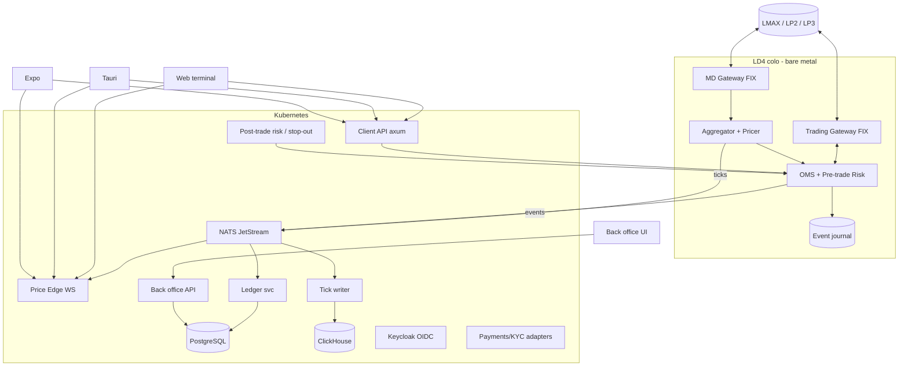

# 03 — Teknoloji Mimarisi (fxvps.ai, 2026-2027)

> Durum: taslak (M0). Benchmark iddiaları kaynakla verilmiştir; kaynaksız sayılar "hedef" olarak işaretlidir.

## 1. Seçilen stack (özet)
| Katman | Seçim | Gerekçe |
|---|---|---|
| Core (OMS, risk, ledger engine, aggregator) | **Rust** (tokio I/O + kritik yolda single-writer thread + ring buffer, Disruptor tarzı) | GC yok, öngörülebilir p99; LMAX Disruptor deseni LMAX'in kendi mimarisinden |
| FIX engine | **Rust: HotFIX** (FIX 4.4 initiator, MIT) birincil; olgunluk riski için yedek **quickfix-rs** (QuickFIX C++ binding, MIT/Apache, yazarına göre "production ready", FIX 4.x/5.x, SQL/dosya store) veya QuickFIX/J | HotFIX: 19 yıldız, yalnız initiator, perf "QuickFIX ile kabaca aynı" (kendi beyanı). FerrumFIX/fefix: "wildly unstable", 1.0 öncesi prod önerilmiyor → yalnız codec/fikir kaynağı |
| İç mesajlaşma | **NATS JetStream** (kontrol/olay), **Aeron** (colo içi IPC/UDP; Apache-2.0, Archive + Raft tabanlı Cluster) | NATS: ikincil kaynaklara göre p50 ~0,5 ms, p99 < 3 ms (kaynak düzeyi blog — kendi ölçümümüz şart). Aeron: 20 µs altı hedef (ikincil); resmi README sayı vermiyor |
| Event log / tick arşivi | **Redpanda** (Kafka API) veya JetStream stream | Redpanda thread-per-core; tail latency'de Kafka'dan ~10x iyi (vendor beyanı) |
| OLTP | **PostgreSQL 17/18** (ledger, hesaplar, CRM) | double-entry, ACID |
| Tick/OHLC | **QuestDB** (ham tick ingest) + **ClickHouse** (analitik/raporlama) | QuestDB'nin kendi TSBS benchmark'ında 4 thread'de ~959k satır/sn, ClickHouse ~914k (8 thread), TimescaleDB ~145k — vendor benchmark'ı, temkinli okunmalı |
| Cache/pubsub | **Valkey** (BSD-3, Linux Foundation) | Redis 7.4 RSAL/SSPL'e geçti (Mar 2024), Valkey 28 Mar 2024'te fork; Redis 8 (May 2025) AGPLv3'ü üçüncü lisans olarak ekledi — AGPL'den kaçınmak için Valkey |
| Client protokolü | WebSocket (binary, **protobuf**; sıcak yolda **SBE/FlatBuffers** değerlendir) + WebTransport (Safari 26.4 ile Mar 2026'da Baseline: Chrome 97+, Firefox 114+, Safari 26.4+; motorlar arası uygulama farkları var → WS birincil, WT ilerleme olarak) | |
| Web terminal | **React 19 + TypeScript + Vite**, state: Zustand/Jotai, SharedWorker ile tek WS bağlantısı çok sekme | |
| Grafik | Başlangıç **TradingView Lightweight Charts** (Apache-2.0; NOTICE + tradingview.com linki zorunlu, `attributionLogo` seçeneği) ; ileride Advanced Charts | Advanced Charts: kapalı kaynak, onaylı şirketlere attribution ile ücretsiz, onay sonrası özel repo; ücretli kotalar ikincil kaynakta ~144k$/yıl (doğrulanmadı) |
| Desktop | **Tauri 2** (stable Ekim 2024; Rust backend core ile kod paylaşımı) | küçük binary |
| Mobil | **React Native + Expo** | Tauri 2 iOS/Android'i resmi destekliyor (Swift/Kotlin plugin), ama ekosistemi RN'den küçük — değerlendirme yargısı |
| Back office | Next.js (App Router) + TS, API: Rust (axum) | |
| Monorepo | **pnpm + Turborepo** (JS) + Cargo workspace (Rust) | |
| Auth | OIDC (**Keycloak** veya Zitadel) + **passkeys/WebAuthn**, back office'te zorunlu MFA | |
| Gözlem | **OpenTelemetry** → Grafana (Tempo/Loki/Mimir) veya SigNoz; HdrHistogram latency | |
| Altyapı | Kubernetes (stateless servisler); FIX GW + core **bare-metal LD4** (Equinix) | k8s'de CPU pinning/netw. jitter riskli |

## 2. Alternatifler tablosu
| Alan | Seçim | Alternatifler | Neden değil (şimdilik) |
|---|---|---|---|
| Core dil | Rust | Java (Chronicle/Aeron ekosistemi), C++ | Java: GC tuning gerekir ama olgun (LMAX Java kullanır); C++: güvenlik/üretkenlik |
| FIX | Rust hotfix/fefix | QuickFIX/J, QuickFIX/n, OnixS (ticari, düşük gecikme), Chronicle FIX (ticari), B2BITS (ticari, Rust binding var) | Ticari: lisans maliyeti; MVP sonrası değerlendirilebilir |
| Messaging | NATS JetStream | Kafka, Redpanda, Aeron Cluster | Aeron Cluster: Raft tabanlı state machine replikasyonu — core HA için M2'de değerlendir |
| Tick DB | ClickHouse | QuestDB, TimescaleDB, kdb+ | kdb+ pahalı; Timescale ingest daha düşük |
| Bundler | Vite | Next.js (terminal için SSR gereksiz) | |
| Mobil | RN/Expo | Tauri mobile, Flutter | Kod paylaşımı TS ile |
| Monorepo | Turborepo | Nx, Bun workspaces | Nx daha ağır; Bun runtime opsiyonel |

## 3. Bileşen diyagramı


## 4. Servis listesi
1. `fix-md-gw` — LP market data sessions, normalize tick.
2. `fix-trade-gw` — LP trading sessions, seq store, idempotent ClOrdID.
3. `aggregator` — consolidated book, filtreler, markup/pricing grupları.
4. `oms` — emir yaşam döngüsü, routing (A/B/hibrit), pre-trade risk.
5. `risk` — margin, equity hesap, margin call / stop-out, exposure, kill-switch.
6. `ledger` — double-entry, swap/komisyon/financing, gün sonu.
7. `price-edge` — müşteriye WS/WebTransport fan-out, throttling/conflation.
8. `client-api` — REST/gRPC-web: hesap, geçmiş, emir.
9. `backoffice-api` — semboller, gruplar, kullanıcı, raporlar.
10. `crm-kyc`, `payments` — dış sağlayıcı adaptörleri.
11. `recon` — LP statement ↔ ledger mutabakatı.
12. `fix-sim` — LP simülatörü (test ve demo).
13. `reporting` — MiFIR/EMIR, müşteri ekstreleri.

## 5. Monorepo yerleşimi
```
fxvps/
  Cargo.toml            # workspace
  package.json pnpm-workspace.yaml turbo.json
  crates/
    fix-codec/  fix-session/  fix-md-gw/  fix-trade-gw/  fix-sim/
    domain/     aggregator/   oms/  risk/  ledger/  recon/
    price-edge/ client-api/   backoffice-api/
    proto/      # .proto/.sbe şemaları + codegen
  apps/
    web-terminal/   # React 19 + Vite
    backoffice/     # Next.js
    desktop/        # Tauri 2 (web-terminal'i sarar)
    mobile/         # Expo
  packages/
    ui/ charts/ protocol-ts/ i18n/ sdk/
  infra/  k8s/ terraform/ colo/ 
  docs/   01-.. 02-fix-likidite-entegrasyonu.md 03-teknoloji-mimarisi.md
  tests/  fix-conformance/ e2e/ load/
```

## 6. Kritik tasarım ilkeleri
- **Single-writer + event sourcing**: OMS/risk durum makinesi tek thread'de, giriş olayları journal'a yazılır; restart = replay. LMAX'in Business Logic Processor'ı JVM'de tek thread'de ~6M emir/sn işliyordu (Fowler, 2011). HA için Aeron Cluster (Raft) modeli örnek alınabilir.
- **Fixed-point** fiyat/miktar (i64 + ölçek), float yasak.
- Idempotency: ClOrdID, ExecID, ledger tx id.
- Client fan-out'ta **conflation** (sembol başına son tick), backpressure.
- Zaman: PTP/chrony, tüm olaylarda ns timestamp (MiFID II RTS 25 saat senkron gereksinimi).

## 7. Güvenlik
- mTLS servisler arası, secrets: Vault/SOPS; FIX parolaları HSM/KMS.
- Back office: RBAC + 4-eyes (para, limit değişikliği), audit log değiştirilemez (append-only).
- Web: CSP, passkeys, cihaz bağlama, oran sınırlama; pen-test M3 öncesi.

## 8. Test
- `fix-sim` + QuickFIX/J tabanlı karşı taraf ile conformance senaryoları.
- Property-based (`proptest`) — ledger invariantları (toplam = 0, master = Σ sub), seq gap senaryoları.
- Deterministik replay testleri (journal'dan), fuzzing (`cargo-fuzz`) FIX parser.
- Yük: tick fan-out (k6/özel Rust client), latency regression CI'da.

## 9. Yol haritası
| Faz | Kapsam | Çıkış kriteri |
|---|---|---|
| M0 | Dokümanlar, LP seçimi, hukuk/lisans kararı | 01-03 onaylı, LMAX UAT başvurusu |
| M1 | FIX codec/session, MD+trading GW, fix-sim | LMAX UAT conformance geçer; 24 saat kesintisiz MD |
| M2 | OMS, risk, ledger, aggregator, recon | Simülatörde uçtan uca emir→fill→ledger; invariant testleri |
| M3 | Web terminal MVP (watchlist, chart, emir, pozisyon) + client-api + price-edge | Demo hesaplarla kapalı beta |
| M4 | Back office (semboller, gruplar, margin, swap, komisyon, A/B-book, KYC/CRM, ödeme, raporlar) | Canlı küçük pilot (lisans durumuna bağlı) |
| M5 | Tauri desktop, Expo mobil, colo optimizasyonu, ikinci LP | Mağaza yayını |

## 10. Belirsizlikler
- LMAX rate limit, drop copy ve pozisyon mesajları desteği — onboarding'de teyit.
- Rust FIX kütüphanelerinin prod olgunluğu: HotFIX küçük topluluk, yalnız initiator; FerrumFIX kararsız. Yedek: quickfix-rs / QuickFIX/J. M1'de iki adayla conformance spike.
- WebTransport Baseline oldu ama uygulamalar tutarsız; WS birincil kalmalı.
- Advanced Charts ticari şartları başvuruyla netleşir.
- Messaging/DB benchmark'larının çoğu vendor veya blog kaynaklı; M1'de kendi donanımımızda ölçüm.

## Kaynaklar
- HotFIX GitHub: https://github.com/Validus-Risk-Management/hotfix
- quickfix-rs: https://github.com/arthurlm/quickfix-rs
- LMAX nanofix / Disruptor: https://github.com/LMAX-Exchange
- Fowler LMAX (6M emir/sn): https://www.martinfowler.com/articles/lmax.html
- Aeron README: https://github.com/aeron-io/aeron ; Adaptive Aeron Cluster: https://weareadaptive.com/trading-resources/blog/aeronhydra/
- Aeron rehberi (ikincil): https://sanj.dev/post/aeron-low-latency-messaging-guide/
- NATS/Redpanda karşılaştırma (ikincil): https://risingwave.com/blog/nats-kafka-or-redpanda-which-real-time-data-solution-is-best/ ; https://www.pkgpulse.com/guides/redpanda-vs-nats-vs-apache-kafka-event-streaming-2026
- QuestDB vs ClickHouse benchmark (vendor): https://questdb.com/blog/clickhouse-vs-questdb-comparison/
- Redis/Valkey lisans: https://devclass.com/2025/04/01/one-year-ago-redis-changed-its-license-and-lost-most-of-its-external-contributors/ ; https://www.phoronix.com/news/Redis-8.0-Goes-AGPLv3
- Lightweight Charts lisans: https://github.com/tradingview/lightweight-charts ; Advanced Charts (ikincil): https://www.luxalgo.com/vela/compare/
- WebTransport Baseline: https://webrtc.ventures/2026/04/webtransport-is-now-baseline-what-it-means-for-real-time-media/
- Tauri 2.0 stable: https://v2.tauri.app/blog/tauri-20/
- LMAX Disruptor: https://lmax-exchange.github.io/disruptor/
- Martin Fowler — The LMAX Architecture: https://martinfowler.com/articles/lmax.html
- FerrumFIX: https://github.com/ferrumfix/ferrumfix , https://docs.rs/fefix/latest
- HotFIX: https://docs.rs/crate/hotfix/latest
- B2BITS FIX engine Rust: https://www.b2bits.com/trading_solutions/fix_engines/fix_engine_rust
- QuickFIX/J: https://www.quickfixj.org/
- Aeron: https://github.com/aeron-io/aeron
- NATS JetStream: https://docs.nats.io/nats-concepts/jetstream
- Redpanda: https://redpanda.com/
- ClickHouse: https://clickhouse.com/ ; QuestDB: https://questdb.com/
- Valkey: https://valkey.io/
- TradingView Lightweight Charts: https://github.com/tradingview/lightweight-charts
- Tauri 2: https://v2.tauri.app/
- Expo: https://expo.dev/
- Turborepo: https://turborepo.com/
- OpenTelemetry: https://opentelemetry.io/
- WebAuthn/passkeys: https://passkeys.dev/
- SBE: https://github.com/aeron-io/simple-binary-encoding
